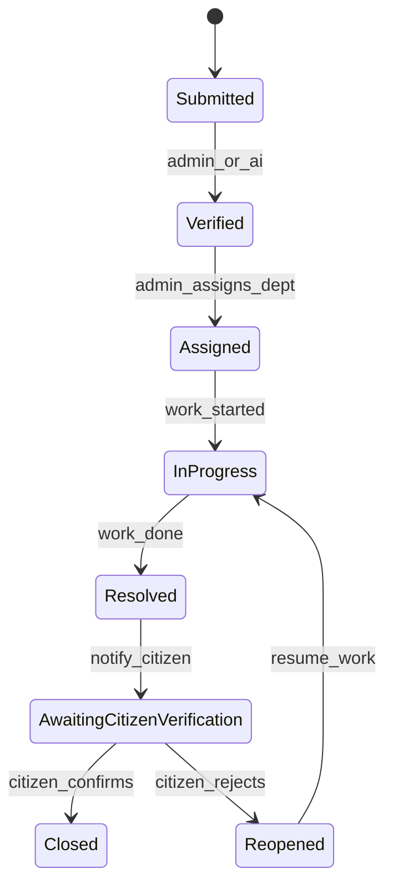
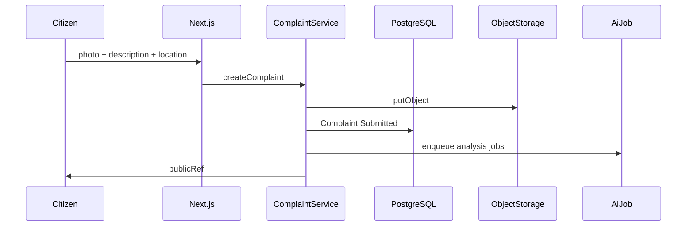
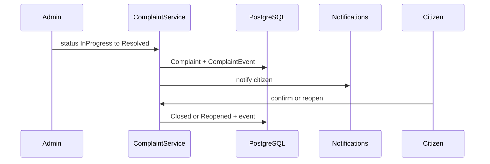
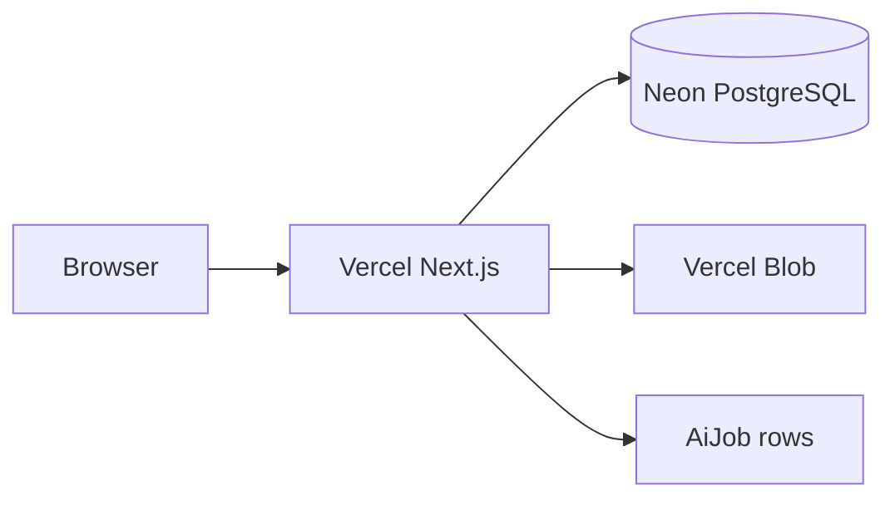

# SheharSaarthi Architecture

**Your City. Your Voice. Your Change.**

This document is the technical source of truth for SheharSaarthi: an AI-powered crowdsourced civic issue reporting and resolution platform. It records what exists today, the production architecture to build toward, and why each choice was made.

**This document does not implement the application.** Implementation must follow this architecture incrementally.

---

## 0. Current repository inspection

Inspected: 2026-08-18. Workspace: `D:\Project EXB`.

| Area | Finding |
|------|---------|
| Project structure | Empty root except markdown stubs |
| Technologies | None installed |
| Dependencies | No `package.json`, lockfile, or language toolchain |
| Components | None |
| Configuration | No Next.js, TypeScript, Docker, or CI config |
| Environment files | No `.env` or `.env.example` |
| Routes | No application |
| Backend / database | No server, ORM, or database |

`PROJECT_CONTEXT.md` exists as a placeholder titled Project EXB. Product requirements below come from the SheharSaarthi brief, not from existing code.

---

## 1. Technology stack

**Decision: one modular Next.js application** (website + API + server logic), PostgreSQL, S3-compatible storage, Leaflet maps, Auth.js sessions, AI as an async worker interface.

| Layer | Choice | Why |
|-------|--------|-----|
| Runtime | Node.js LTS | Standard for Next.js; simple operations story |
| Language | TypeScript | Safer refactors; explicit domain types for roles and complaint status |
| Web framework | Next.js (App Router) | Server Components, Route Handlers, middleware, one deployable |
| UI | Tailwind CSS + shared React primitives | Fast, accessible, mobile-first civic UI without a SaaS dashboard kit |
| ORM | Prisma | Typed schema, migrations, transactions |
| Database | PostgreSQL | Relational complaints + audit log; later PostGIS if geo queries grow |
| Auth | Auth.js (NextAuth v5) | HttpOnly cookie sessions; credentials now, municipal SSO later |
| Maps | Leaflet + OpenStreetMap | No billed Google/Mapbox key for the civic MVP |
| Files | Vercel Blob locally via Marketplace token; Blob in production | Photos must not live in git or the public web root |
| Notifications (v1) | Postgres-backed in-app | Avoid SMS/email vendors until the product needs them |
| AI | Provider-agnostic worker + `AiJob` table | Reporting must not block on a model; secrets stay on the server |
| Deploy | Vercel (app) + Neon Postgres + Blob | Repeatable preview and production deploy; Kubernetes is not required yet |

**Explicitly not used unless a later milestone proves the need**

- Separate Nest/Express microservice repo
- GraphQL
- Redis, Kafka, Elasticsearch
- Kubernetes
- Client-side JWT in `localStorage`

Rationale: SheharSaarthi is one product with two roles and a clear lifecycle. A modular monolith is scalable enough, easier to secure, and cheaper to operate for a municipality than a distributed system.

---

## 2. Frontend architecture

### Principles

- Feel like a **civic technology platform**: trustworthy, government-grade, clean, accessible, fast, simple for non-technical citizens.
- **Do not** look like a generic AI startup dashboard.
- Mobile-responsive first; large tap targets; high contrast.
- Server Components by default. Client Components only for maps, geolocation, photo capture, and interactive filters.
- Reuse components. Do not duplicate complaint cards, status badges, or form fields.

### Route groups

```
src/app/
  (public)/          landing, about, citizen login, citizen register, admin login
  (citizen)/         dashboard, report, my complaints, complaint detail
  (admin)/           dashboard, complaint management, map, analytics
```

| Surface | Routes (logical) | Notes |
|---------|------------------|--------|
| Public | `/`, `/login`, `/register`, `/admin/login` | No auth required |
| Citizen | `/dashboard`, `/report`, `/complaints`, `/complaints/[id]` | Own data only |
| Admin | `/admin`, `/admin/complaints`, `/admin/complaints/[id]`, `/admin/map`, `/admin/analytics` | Municipality staff |

Citizen and administrator **logins are separate URLs** and layouts. Same session mechanism underneath.

### UI module boundaries

| Module | Responsibility |
|--------|----------------|
| `components/ui` | Buttons, inputs, select, dialog, table, empty/loading/error states |
| `components/complaint` | `ComplaintCard`, `ComplaintStatusBadge`, timeline |
| `components/maps` | Location picker, admin complaint map (no citizen PII on markers) |
| `components/layout` | Public header/footer, citizen shell, admin shell |

### Civic visual language (implementation constraint)

- Deep teal as primary (trust, municipal)
- Saffron as a spare accent (India civic identity), not neon gradients
- Neutral surfaces, clear typography, visible focus rings
- English copy first; layout should not break if Hindi is added later

Forms: client hints + **server-side validation**. Every mutating screen has loading and error states.

---

## 3. Backend architecture

**Decision: domain modules inside the Next.js app**, not a second HTTP service.

All mutations go through **domain services**. Server Actions (website forms) and Route Handlers (`/api/v1`) call the same functions. That keeps rules in one place for a future mobile client.

```
Request (page, Server Action, or /api/v1)
  → middleware (session + coarse RBAC)
  → domain service (validation, authorization, lifecycle)
  → repository (Prisma)
  → PostgreSQL / object storage / AiJob enqueue
```

### Domain modules

| Domain | Owns |
|--------|------|
| `auth` | Register, login, session, password hashing |
| `users` | Profiles; **PII access policy** |
| `departments` | Department catalog, assignment targets |
| `complaints` | Create, read scoped lists, status transitions, reopen |
| `notifications` | In-app notification write/read/mark-read |
| `maps` | GeoJSON for admin map (sanitized DTOs) |
| `analytics` | Aggregates: counts, resolution time, department performance |
| `ai` | Job enqueue, stub/real provider, result persistence |
| `storage` | Upload validation, object keys, signed URLs |

### Layering inside a domain

```
types.ts        status enums, DTOs
policy.ts       who may see/change what
validation.ts   Zod (or equivalent) schemas
repository.ts   Prisma queries only
service.ts      orchestration, transactions, side effects
```

UI and Route Handlers must not run raw Prisma for business writes.

---

## 4. Database architecture

PostgreSQL is the system of record. Prisma owns migrations.

### Logical model

```
User 1──* Complaint (as citizen)
User 1──* Complaint (as assignee, optional)
Department 1──* Complaint
Complaint 1──* ComplaintEvent     immutable audit
Complaint 1──* Notification
Complaint 1──* AiJob
Complaint  *──1 Complaint         duplicateOf (optional, AI later)
```

### Tables (conceptual)

**User**

- `id`, `role` (`CITIZEN` \| `ADMIN`; later `FIELD_WORKER`)
- `name`, `email` (unique), `phone`, `passwordHash`
- `createdAt`, `updatedAt`

**Department**

- `id`, `name`, `slug`, `isActive`

**Complaint**

- `id`, `publicRef` (human-readable, e.g. `SS-2026-000123`)
- `citizenId`, `departmentId` (nullable until assigned), `assigneeId` (nullable)
- `category`, `description`, `priority` (manual in v1; AI may suggest)
- `photoKey` (object storage key, not a public URL)
- `lat`, `lng`, `address`
- `status` (see lifecycle)
- AI fields (nullable): `aiCategory`, `aiPriority`, `aiVerified`, `duplicateOfId`, `aiConfidence`
- `resolvedAt`, `closedAt`, timestamps

**ComplaintEvent**

- `id`, `complaintId`, `actorId` (nullable for system/AI)
- `fromStatus`, `toStatus`, `note`
- `createdAt`  
  Insert-only. Status changes always write a row in the same transaction.

**Notification**

- `id`, `userId`, `complaintId`, `type`, `title`, `body`, `readAt`

**AiJob**

- `id`, `complaintId`, `type` (classify, image, duplicate, priority, …)
- `status` (`PENDING` \| `RUNNING` \| `SUCCEEDED` \| `FAILED`)
- `payload` / `result` JSON, `error`, timestamps

### Indexes

- `Complaint(status)`, `(departmentId, status)`, `(citizenId, createdAt)`
- `Complaint(category)`, `(createdAt)`
- Coordinate lookup: `(lat, lng)` or later PostGIS `geography`
- `Notification(userId, readAt)`
- `AiJob(status, createdAt)`

### Privacy in the data layer

Citizen name, email, and phone **live only on `User`**. Map and field-facing queries select issue fields + coordinates, never join citizen PII into those DTOs.

---

## 5. Authentication architecture

### Model

- **Session cookies** via Auth.js: `HttpOnly`, `Secure` (production), `SameSite=Lax`.
- Credentials provider for v1 (email + password). Phone OTP and municipal SSO are later adapters, not a second auth product.
- Passwords hashed with Argon2 or bcrypt. Never stored or logged in plaintext.
- No access tokens in JavaScript storage.

### Flows

1. Citizen registers → `User` with `role=CITIZEN` → session.
2. Citizen logs in at `/login`.
3. Administrator logs in at `/admin/login`. Only `role=ADMIN` accounts succeed on that form (same session cookie name, different UI and post-login redirect).
4. Middleware:
   - Unauthenticated citizen routes → `/login`
   - Unauthenticated admin routes → `/admin/login`
   - `CITIZEN` hitting `/admin/**` → forbidden
   - `ADMIN` may not impersonate a citizen or mutate another admin’s identity

### Session contents

Minimal: `userId`, `role`. Load PII from the database when a page actually needs it.

Admin accounts are **seeded or provisioned**, not self-serve public registration.

---

## 6. Storage architecture

Complaint photographs are evidence. They must be durable, access-controlled, and validated.

| Concern | Rule |
|---------|------|
| Ingress | Upload through the server (Route Handler or Server Action), never a public unauthenticated bucket |
| Validation | MIME allowlist (`image/jpeg`, `image/png`, `image/webp`), max size, reject HTML/SVG-as-image tricks |
| Persistence | Object key in DB (`complaints/{id}/{uuid}.jpg`); bytes in Vercel Blob (or `./storage` locally) |
| Egress | Authenticated `/api/v1` media route; admin detail and citizen-own-complaint only |
| Map / lists | Thumbnails optional; still no citizen identity in the payload |
| Local vs prod | Local disk without a Blob token; Vercel Blob on Vercel |

Do not store uploads under `public/` in production. That would make evidence world-readable.

---

## 7. AI architecture

AI is a **pipeline**, not the request path.

### Why async

Citizens on slow networks must get a durable complaint number immediately. Model latency, outages, or cost must not block `Submitted`.

### Job types (eventual)

1. Complaint verification (is this a real civic issue image?)
2. Image analysis
3. Image–description matching
4. Automatic issue classification
5. Priority prediction
6. Duplicate complaint detection (geo + visual + text)
7. Predictive maintenance analytics (batch, not per-report)

### Design

```
Citizen submits complaint
  → persist Complaint (Submitted)
  → insert AiJob rows (PENDING)
  → return publicRef to citizen

Worker (later process or cron)
  → claim jobs
  → AiProvider.analyze(...)
  → write ai* fields + optional duplicateOfId
  → optionally emit ComplaintEvent (system actor) if auto-verify is enabled
```

**`AiProvider` interface** (server-only):

- `stub` — deterministic no-op or heuristic placeholders for UI development
- later: a real vendor or on-prem model

API keys never use the `NEXT_PUBLIC_` prefix. The website talks to domain `ai` services, not to the model vendor.

Predictive maintenance reads closed complaints in batch (hotspots, repeat categories) and writes analytics tables or materialized views — it does not sit on the report form.

Until a worker exists, enqueueing jobs is still the correct write path so the schema does not change later.

---

## 8. API architecture

Versioned REST under `/api/v1`. JSON in, JSON out, stable error codes.

Website forms should prefer Server Actions that call **the same services** as these handlers, so authorization cannot drift.

### Resource sketch

| Method | Path | Who |
|--------|------|-----|
| POST | `/api/v1/auth/register` | Public (citizen) |
| POST | `/api/v1/auth/login` | Public (handled by Auth.js) |
| GET | `/api/v1/me` | Authenticated |
| POST | `/api/v1/complaints` | Citizen |
| GET | `/api/v1/complaints` | Citizen: own; Admin: all (filtered) |
| GET | `/api/v1/complaints/:id` | Owner or admin; PII stripped for non-admin |
| POST | `/api/v1/complaints/:id/transitions` | Role-constrained lifecycle |
| POST | `/api/v1/complaints/:id/verify` | Citizen owner (confirm or reopen) |
| PATCH | `/api/v1/admin/complaints/:id/assignment` | Admin |
| GET | `/api/v1/admin/map` | Admin GeoJSON |
| GET | `/api/v1/notifications` | Authenticated, own |
| GET | `/api/v1/admin/analytics` | Admin |

### Conventions

- `publicRef` in citizen-facing responses; internal UUIDs allowed internally
- Pagination on lists (`cursor` or `page` + `limit`)
- Filters: status, category, department, date range, bounding box (admin)
- Errors: `{ code, message }` — no stack traces
- Rate-limit `POST /complaints` and auth endpoints

---

## 9. Role-based access control

Enforced in **middleware (coarse) and every domain service (fine)**. UI hiding is not security.

| Role | May |
|------|-----|
| Anonymous | View landing; register as citizen; log in |
| `CITIZEN` | Create reports; view own history; receive notifications; confirm resolution; reopen if issue persists |
| `ADMIN` | View all complaints; search/filter; assign department and personnel; change status along the lifecycle; map; analytics; view citizen PII **on complaint detail only** |
| `FIELD_WORKER` (future) | See assigned work, location, photos, description — **never** citizen name, phone, or email |

### PII matrix

| Surface | Citizen identity |
|---------|------------------|
| Public landing | Not shown |
| Admin map markers | Hidden |
| Admin list table | Hidden or last-4 / ref only; full PII on detail |
| Field worker views | Hidden |
| Admin complaint detail | Visible to `ADMIN` only |
| Citizen own detail | Own data only |

---

## 10. Complaint lifecycle

Canonical statuses:

`Submitted` → `Verified` → `Assigned` → `In Progress` → `Resolved` → `Awaiting Citizen Verification` → `Closed`

If the citizen rejects the resolution:

`Awaiting Citizen Verification` → `Reopened` → `In Progress`



### Transition rules

| From | To | Actor |
|------|----|--------|
| Submitted | Verified | Admin (or AI later, if confidence policy allows) |
| Verified | Assigned | Admin (department required) |
| Assigned | In Progress | Admin / future field worker |
| In Progress | Resolved | Admin / future field worker |
| Resolved | Awaiting Citizen Verification | System on resolve |
| Awaiting Citizen Verification | Closed | Citizen owner |
| Awaiting Citizen Verification | Reopened | Citizen owner |
| Reopened | In Progress | System |

Illegal transitions are rejected in `complaints` domain `policy.ts`, not only in the UI. Each legal transition inserts `ComplaintEvent` and may insert `Notification`.

---

## 11. Data flow

### Report



### Admin resolution and citizen verify



### Read paths

- Citizen list/detail: `WHERE citizenId = session.userId`
- Admin list: filters + no PII columns in the table query
- Admin detail: join `User` for PII
- Admin map: `id`, `publicRef`, `category`, `status`, `lat`, `lng` only
- Analytics: SQL aggregates on `Complaint` / `ComplaintEvent` (resolution time = `resolvedAt - createdAt`)

---

## 12. Security architecture

| Control | How |
|---------|-----|
| Transport | HTTPS in production; HSTS |
| Auth | Session cookies; CSRF protection via Auth.js / Server Action origin checks |
| Authorization | RBAC in middleware + services |
| Injection | Prisma parameterized queries only |
| Uploads | Type/size allowlist; authenticated upload |
| Secrets | Server env only; never shipped to the client |
| Headers | `X-Content-Type-Options`, `Referrer-Policy`, `Content-Security-Policy` (maps may need OSM tile origins) |
| Rate limits | Auth + report creation |
| Audit | `ComplaintEvent` for every status/assignment change |
| PII | Least privilege; field workers designed out of identity access |
| Dependencies | Lockfile; no secrets in git |

Admin analytics and maps are **not public**. Duplicate-detection results must not expose other citizens’ identities to the reporter (show “similar open issue nearby” without names).

---

## 13. Deployment architecture

**v1 target: Vercel** for the Next.js app, Neon Postgres, and Vercel Blob.



| Service | Role |
|---------|------|
| Vercel | Next.js (web + `/api/v1`) |
| Neon | System of record |
| Vercel Blob | Private evidence photos |
| AI worker | Optional later; until then jobs sit `PENDING` |

**Production substitutions** (same app):

- Restricted Postgres role without `BYPASSRLS`
- Custom domain + `AUTH_URL`
- Shared rate limiter if more than one instance matters

**Not in v1:** Kubernetes, multi-region active-active, a separate API cluster.

Backups: Neon PITR / logical dumps + Blob retention. Run Prisma migrations as a release step, not from random app replicas concurrently without a lock.

---

## 14. Folder structure

**Decision: root-level Next.js app** (no turborepo) until a second package is justified.

```
/
  ARCHITECTURE.md
  PROJECT_CONTEXT.md
  README.md                 (added when the app is scaffolded)
  .env.example              (added when the app is scaffolded)
  vercel.json
  package.json
  prisma/
    schema.prisma
    migrations/
    seed.ts
  public/                   (static brand assets only — not uploads)
  src/
    app/
      (public)/
      (citizen)/
      (admin)/
      api/v1/
      layout.tsx
    domains/
      auth/
      users/
      departments/
      complaints/
      notifications/
      maps/
      analytics/
      ai/
      storage/
    components/
      ui/
      complaint/
      maps/
      layout/
    lib/
      db.ts
      auth.ts
      rbac.ts
      env.ts
    middleware.ts
```

Reuse existing domain modules when features are added. Do not add a parallel `services/` tree that duplicates `domains/`.

---

## 15. Environment variables required

Never commit real `.env` files. When scaffolding, add `.env.example` with empty values.

| Variable | Required | Purpose |
|----------|----------|---------|
| `DATABASE_URL` | Yes | PostgreSQL / Neon connection string |
| `AUTH_SECRET` | Yes | Auth.js session signing (≥ 32 random bytes) |
| `AUTH_URL` | Yes | Public origin, e.g. `http://localhost:3000` |
| `BLOB_READ_WRITE_TOKEN` | Yes on Vercel | Private evidence photos (OIDC may replace the token on Vercel) |
| `AI_PROVIDER` | Yes | `stub` until a real provider is wired |
| `AI_API_KEY` | No | Server-only; omit while `AI_PROVIDER=stub` |

**Forbidden:** putting `AI_API_KEY`, `AUTH_SECRET`, or Blob/S3 secrets on any `NEXT_PUBLIC_*` variable.

Optional later (not required by this architecture): `SMTP_*`, SMS gateway keys, `SENTRY_DSN`, municipal SSO client IDs.

---

## Implementation posture (for later work)

1. Read this file and `PROJECT_CONTEXT.md` before changing code.
2. Build incrementally: scaffold → auth → citizen report/track → admin triage → map/analytics → AI worker.
3. Reuse domain modules and UI components; do not fork duplicates.
4. Do not break lifecycle or PII rules to ship a screen faster.
5. Validate forms, handle loading and errors, keep the UI responsive.
6. Do not implement major features in the same change as architecture-only documentation.

---

## Decision log

| Date | Decision | Why |
|------|----------|-----|
| 2026-08-18 | Modular Next.js monolith | Empty repo; one civic product; avoid premature microservices |
| 2026-08-18 | PostgreSQL + Prisma | Complaints, audit, RBAC are relational |
| 2026-08-18 | Auth.js cookie sessions | Fits a website; safer than SPA JWTs |
| 2026-08-18 | Vercel Blob for photos | Private evidence on Vercel; local disk without a Blob token |
| 2026-08-18 | Leaflet + OSM | Maps without a commercial key |
| 2026-08-18 | AI via `AiJob` + provider interface | Features 1–7 designed in; submit path stays reliable |
| 2026-08-18 | Vercel + Neon + Blob, not Docker Compose | App, database, and evidence photos on Vercel Marketplace |
| 2026-08-18 | Field worker role designed, not built | Privacy constraint is architectural, even before that UI exists |
